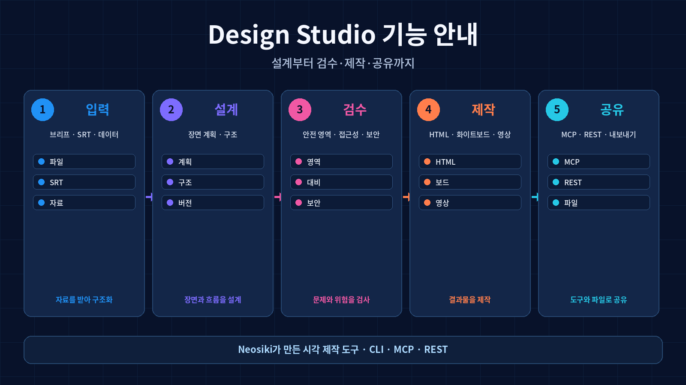
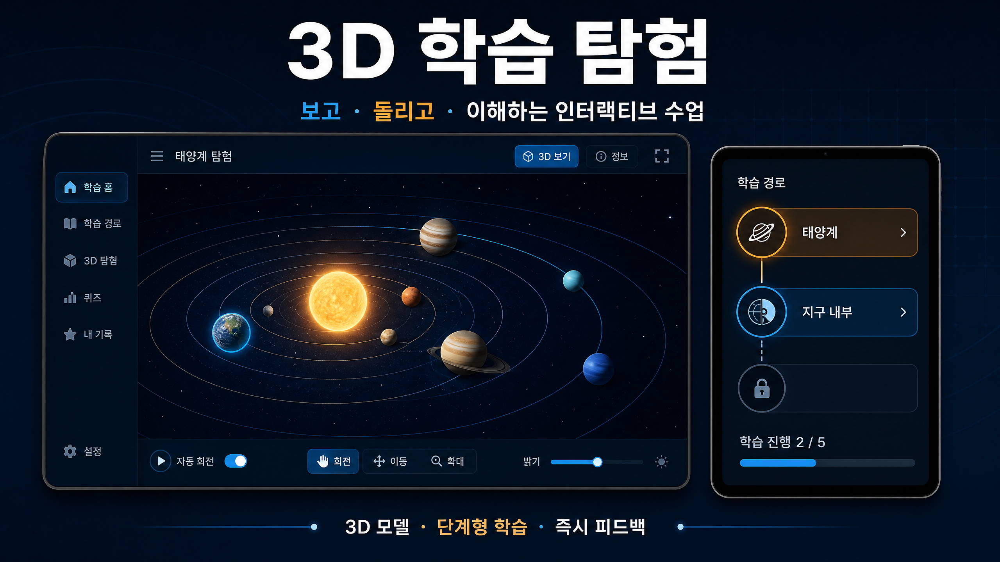

<div align="center">

# 디자인 스튜디오

> **대화 한 번으로, 검토·공유·제출할 수 있는 시각 결과물을 만듭니다.**

[](LICENSE)
[](https://skills.sh)
[](https://skills.sh)

```bash
npx skills add Neosiki/design-studio
```

[빠른 시작](#빠른-시작) · [한국어 영상·실습](#한국어-영상과-실습-자료) · [실제 사례](#실제-사례) · [사례별 심화 가이드](#사례별-심화-가이드) · [제작 절차](#안전한-제작-절차) · [세부 가이드](#세부-가이드)

</div>

---

## 디자인 스튜디오는 무엇을 하나요

디자인 스튜디오는 Claude Code, Codex, Cursor 등에서 사용할 수 있는 시각 제작 스킬입니다. 요청의 목적과 대상, 자료를 바탕으로 **클릭 가능한 앱·웹 프로토타입, 발표용 슬라이드, 데이터 시각화, 인포그래픽, 영상용 화면과 애니메이션**을 만들고 검수·내보내기까지 안내합니다.

| 작업 유형 | 대표 결과물 | 함께 제공하는 검수 기준 |
| --- | --- | --- |
| 앱·웹 화면 | 클릭 가능한 HTML 프로토타입, 화면별 상태 정의 | 핵심 경로 클릭 점검, 반응형 확인 |
| 발표·강의 자료 | HTML 슬라이드, 편집 가능한 PPTX | 텍스트 편집성, 발표 흐름, 화면 비율 |
| 데이터저널리즘 | 지도·차트·기사용 시각화, 영상 카드 | 출처·기간·단위·결측치 확인 |
| 영상·모션 | 타임라인 애니메이션, MP4·GIF | 장면 순서, 자막 가독성, 프레임 확인 |
| 인포그래픽 | PDF·PNG·SVG용 시각화 | 정보 계층, 인쇄·공유 해상도 |

> **작업 원칙**: 시각 결과물을 먼저 제시하고, 선택·피드백·개선의 순서로 진행합니다. 실제 수치가 있는 차트는 출처와 단위를 확인하고, 브랜드 작업은 공식 자산을 우선 사용합니다.

---

## 빠른 시작

### 1. 설치하기

다음 명령으로 스킬을 설치합니다.

```bash
npx skills add Neosiki/design-studio
```

설치 후 `SKILL.md`, `references/`, `assets/`, `scripts/`, `demos/`가 함께 설치되었는지 확인하세요. 문제가 있으면 최신 `skills` CLI로 다시 설치하거나 아래처럼 저장소를 직접 클론할 수 있습니다.

```bash
npm i -g skills@latest
git clone https://github.com/Neosiki/design-studio.git ~/.claude/skills/design-studio
```

### 2. 목적·대상·자료를 한 문장에 담기

좋은 요청은 **무엇을 만들지**, **누가 볼지**, **어떤 자료를 쓸지**를 함께 알려 줍니다. 자료가 아직 없다면 우선 가정과 빈칸을 명시한 시안을 요청한 뒤 보완하면 됩니다.

```text
한반도 지진 데이터를 바탕으로 고등학생용 3분 수업 슬라이드를 만들어 줘.
수치는 출처와 기간을 표시하고, 지도·연도별 추이·핵심 사건 3개를 포함해 줘.
```

### 3. 결과물을 확인하고 내보내기

초안에서 정보 계층과 수치, 브랜드 자산, 상호작용을 먼저 점검합니다. 승인한 뒤 목적에 맞는 HTML, PPTX, PDF, PNG, SVG, MP4 또는 GIF로 내보냅니다. 세부 검수 기준은 [세부 가이드](#세부-가이드)를 참고하세요.

---

## 기능 시각 안내

Design Studio로 할 수 있는 작업을 한눈에 볼 수 있도록 기능 흐름을 이미지·애니메이션·동영상으로 정리했습니다. 입력 자료를 바탕으로 장면을 설계하고, 안전 영역·접근성·보안 게이트를 검수한 뒤 HTML·화이트보드·애니메이션·영상을 제작하고 MCP·REST·내보내기로 공유하는 과정을 보여 줍니다.



| 형식 | 파일 | 활용 목적 |
|---|---|---|
| 이미지 | [`design_studio_feature_overview.png`](assets/feature-overview/design_studio_feature_overview.png) | README와 문서에서 전체 기능 흐름을 빠르게 확인 |
| 애니메이션 | [`design_studio_feature_overview.gif`](assets/feature-overview/design_studio_feature_overview.gif) | 입력부터 공유까지 단계별 동작을 반복 재생 |
| 동영상 | [`design_studio_feature_overview.mp4`](assets/feature-overview/design_studio_feature_overview.mp4) | 제품 소개·데모·발표 자료용 고해상도 영상 |

## P0 작업 운영 기능

Design Studio는 렌더 작업을 한 번 실행하고 끝내는 방식이 아니라, 작업 상태를 저장하고 중단·재시작할 수 있는 작업 관리 흐름을 제공합니다. 렌더를 실행하면 작업 ID가 생성되며 산출물별 `queued`, `running`, `done`, `skipped`, `failed` 상태와 전체 진행률이 `.design/jobs/`에 기록됩니다.

```bash
# 작업 생성·조회·취소·재시도
design jobs create --kind render --artifact site
design jobs list
design jobs status <job-id>
design jobs cancel <job-id>
design jobs retry <job-id>

# 작업 ID를 지정한 렌더 실행
design render --job <job-id>
```

렌더 중 입력·IR·자산·산출물 해시가 바뀌면 해당 산출물은 `stale`로 표시됩니다. 변경되지 않은 산출물은 다시 만들지 않으며, 캐시 상태와 stale 사유를 다음 명령으로 확인할 수 있습니다.

```bash
design cache status
design cache clear
```

검수 후에는 오류와 경고를 자동 수정 제안으로 변환할 수 있습니다. 제안은 바로 적용되지 않으며, 먼저 미리보기를 확인한 뒤 기존 체크포인트·승인 흐름에 따라 적용하도록 설계되어 원본을 보호합니다.

```bash
design check
design suggest list
design suggest preview <suggestion-id> --source source.json --path /scene/title --value '새 제목'

# 미리보기 결과를 확인한 뒤에만 승인 적용
# --approve가 없으면 원본을 변경하지 않고 적용 예정 내용만 반환
design suggest apply <suggestion-id> --source source.json --path /scene/title --value '새 제목' --approve
```

승인 적용 대상은 프로젝트 내부의 JSON 파일로 제한되며, 적용 전 `.design/suggestion-backups/`에 원본 백업을 남깁니다. JSON Pointer 경로를 통해 지정한 기존 필드만 변경하고, 루트 교체나 프로젝트 외부 파일·위험한 프로토타입 경로는 거부합니다.

MCP와 REST에서도 같은 기능을 사용할 수 있습니다. MCP 도구는 `design_jobs`, `design_cache`, `design_suggestions`이며, REST 작업 이름은 `jobs`, `cache`, `suggestions`입니다. 세 인터페이스는 같은 구조화된 상태·오류·stale 사유·수정 제안 계약을 공유합니다. `suggestions`의 `apply` 동작은 `approved: true`가 명시된 경우에만 원본을 변경합니다.

## 기능 고도화 히스토리

이 저장소는 문서와 명칭을 정리하는 데 그치지 않고, 시각 결과물을 **설계하고 검수하고 내보내는 실행 기능**을 단계적으로 확장해 왔습니다. 아래는 실제 기능 추가와 품질 개선을 중심으로 정리한 고도화 이력입니다.

### 1단계 — 기본 제작 파이프라인 구축

프로젝트 초기화, IR·스키마 생성, 상태 확인, 검수, 렌더링, 보고서 생성을 하나의 CLI 흐름으로 통합했습니다. 사용자는 `init → status → verify → render` 순서로 작업을 진행하고 HTML·영상·화이트보드 결과물을 일관된 구조로 관리할 수 있습니다.

### 2단계 — 화이트보드와 멀티미디어 제작 기능 확장

SRT를 장면 계획과 IR로 변환하고, 장면 배치·보호 영역·주석·SVG 렌더링·탐색 재생을 처리하는 화이트보드 파이프라인을 추가했습니다. 음성·배경음악 더킹 계획, 무음 작업본과 최종본 분리, 소프트 자막 연결도 함께 지원합니다.

### 3단계 — 안전 영역과 품질 게이트 도입

텍스트·레이어·뒤 요소를 분석해 보호 영역을 계산하고, 화면 밖 배치와 선노출을 자동으로 차단하도록 검수 기능을 강화했습니다. 콘텐츠·디자인·미디어·접근성·출처·보안·구조·타이포그래피 검사를 제작 흐름에 연결해 결과물을 내보내기 전에 확인할 수 있도록 했습니다.

### 4단계 — 스타일 레지스트리와 추천 기능 고도화

스타일 문서에서 60개 항목을 추출하고, 분류·중복 ID·DNA·구현·용도를 검증하는 레지스트리를 구축했습니다. 스타일 검색·추천·적용, 재현도 기반 정렬, 색상·대비·팔레트 정규화, 원본 문서와 생성 레지스트리의 일치 검증을 지원합니다.

### 5단계 — Studio 편집·체크포인트·수정 연산 추가

편집 결과를 적용하기 전에 체크포인트를 만들고, 변경점 비교·복구·수정 요청 큐·`--apply` 적용을 수행할 수 있게 했습니다. 스키마 위반이나 선노출을 만드는 수정은 거부하고, 여러 연산 중 하나라도 실패하면 전체를 롤백해 원본을 보호합니다.

### 6단계 — MCP와 REST 인터페이스 통합

프로젝트 초기화, 상태 조회, 검사, 수정, 체크포인트, 승인, 생성, 복구 기능을 MCP 도구와 REST API로 함께 노출했습니다. 작업별 스키마, HTTP 상태 코드, 구조화된 오류, 읽기·쓰기 메서드 분리, `dryRun`, `tools/list`, `tools/call`을 지원해 자동화 클라이언트가 동일한 기능을 사용할 수 있습니다.

### 7단계 — 선택형 클라우드 기능과 승인 게이트 분리

TTS와 영상 검토 같은 클라우드 기능을 로컬 제작 기능과 분리하고, API 키·환경변수·네트워크 대상·명시적 동의가 확인된 경우에만 실행되도록 구성했습니다. 승인 전 생성 차단, 삼방향 증거 확인, 면제 사유 검증을 통해 자동화 과정의 안전성을 높였습니다.

### 8단계 — 자동 검증과 실행 안정성 강화

GitHub Actions와 로컬 테스트를 연결하고, 브라우저 문법·번들 충돌·프로토콜 출력 오염·비밀값 노출·접근성·스타일 레지스트리·MCP·REST·화이트보드·Studio 동작을 자동 검증하도록 확장했습니다. 현재 전체 회귀 테스트는 **242개 통과, 0개 실패** 상태입니다.

이 히스토리는 번역·브랜드명 변경·커밋 기록 정리 같은 비기능 변경을 제외하고, 실제 기능과 실행 안정성에 영향을 준 고도화만 기록합니다.

## 한국어 영상과 실습 자료

### 한반도 지진 데이터저널리즘 실습

아래 영상과 시각화 카드는 이 스킬을 활용해 구성한 실제 한국어 데이터저널리즘 사례입니다. 2005년부터 2026년 6월 16일까지의 한반도 지진 기록 1,769건을 바탕으로 기록 개요, 연도별 추이, 규모 분포, 권역 분포, 주요 사건을 차례로 설명합니다. 영상은 9:16 비율의 44초 H.264 MP4입니다. [1]

<p align="center">
  <a href="https://github.com/Neosiki/korean-earthquake-data-journalism/blob/main/media/korean_earthquake_data_journalism_vertical_extended.mp4">
    
  </a>
</p>

| 자료 | 활용 방법 |
| --- | --- |
| [세로형 데이터저널리즘 영상](https://github.com/Neosiki/korean-earthquake-data-journalism/blob/main/media/korean_earthquake_data_journalism_vertical_extended.mp4) | 수업 도입, 쇼츠·릴스형 설명, 결과물 흐름 검토 |
| [시각화 카드 5종](https://github.com/Neosiki/korean-earthquake-data-journalism/tree/main/media) | 기간·건수·분포·주요 사건을 카드 단위로 설명 |
| [인터랙티브 지진지도와 강의 자료](https://github.com/Neosiki/korean-earthquake-data-journalism) | 데이터 수집·정제·지도화·기사 작성의 전체 실습 |

> 데이터저널리즘 결과물은 시각적 완성도보다 먼저 **원천기관, 수집일, 분석 범위, 결측치·중복 처리 방식**을 문서화해야 합니다. 원본 프로젝트는 KMA·웨더아이 기반 CSV와 실무 강의 자료를 함께 제공합니다. [2]

---

## 실제 사례

### 데이터저널리즘: 데이터에서 기사·지도·영상으로

<p align="center">
  
</p>

이 사례는 공공·기상 데이터 수집, CSV 정제, 위치·깊이·진도 시각화, 데이터 기반 설명자료 작성을 하나의 수업 흐름으로 연결합니다. 숫자를 꾸미는 대신, 어떤 기간과 필드를 사용했는지 먼저 밝혀 해석 가능한 시각화를 만드는 방식을 보여 줍니다. [2]

### 3D 학습 앱: 보고·돌리고·이해하는 인터랙티브 수업

<p align="center">
  
</p>

3D 학습 앱은 복잡한 개념을 단순한 화면 전환으로 축소하지 않고, **3D 모델 조작 → 단계형 과제 → 즉시 피드백**의 흐름으로 구성합니다. 위 이미지는 디자인 스튜디오로 제작 가능한 한국어 학습 앱의 예시 시각 자료이며, 태양계·지구 내부 같은 주제를 회전·확대·정보 보기와 연결하는 화면 구조를 제안합니다.

| 설계 요소 | 학습 경험 | 구현·검수 포인트 |
| --- | --- | --- |
| 3D 모델 조작 | 회전·이동·확대로 구조를 직접 탐색 | 조작 안내, 초기 시점, 성능 확인 |
| 단계형 학습 경로 | 기초 개념에서 응용 과제로 이동 | 잠금·완료 상태, 다음 단계 안내 |
| 즉시 피드백 | 선택 직후 핵심 개념을 확인 | 정답 근거, 재시도 경로, 오류 상태 |

---

## 사례별 심화 가이드

README의 요약 사례를 실제 제작·학습 절차로 확장하려면 아래 문서를 사용하세요.

| 사례 | 추가 문서 |
| --- | --- |
| 데이터저널리즘 | [한반도 지진 기록을 기사·지도·영상으로 바꾸기](docs/examples/data-journalism-korean-earthquake.md) |
| 3D 학습 앱 | [관찰·조작·질문·피드백으로 구성하는 학습 흐름](docs/examples/3d-learning-app-korean.md) |
| 공통 문서 작성 | [한국어 사례 모음](docs/examples/README.md) |

3D 화면은 실제 작동 앱의 증거가 아니라 학습 흐름을 설명하는 예시 시각 자료로 표시합니다. 데이터저널리즘 문서는 원천·기간·단위·결측치·한계를 확인한 뒤 결과물을 제작하도록 구성했습니다.

---

## 안전한 제작 절차

| 단계 | 진행 방식 | 확인할 내용 |
| --- | --- | --- |
| 1. 목적 확인 | 대상·매체·핵심 메시지와 제약을 정리 | 독자, 화면 비율, 마감, 산출물 형식 |
| 2. 자료 수집 | 공식 브랜드 자산·데이터 원천·저작권 상태 확인 | 로고·색상·출처·사용 허가 |
| 3. 시안 제시 | 서로 다른 3가지 방향을 실제 화면으로 비교 | 정보 계층, 색상, 타이포그래피, 밀도 |
| 4. 제작 | 선택한 방향을 HTML·슬라이드·영상·이미지로 확장 | 상태 전환, 콘텐츠 구조, 내보내기 설정 |
| 5. 검수·내보내기 | 화면과 수치, 링크, 파일 형식을 최종 점검 | 클릭 경로, 맞춤법, 출처, 해상도 |

작업 대상이 명확하지 않을 때는 “어떤 디자인이 좋은가”라는 질문만 남기지 않습니다. 목적과 제약을 확인한 뒤, 선택 가능한 시각 시안을 먼저 제시하고 그 결과를 바탕으로 제작을 진행합니다.

---

## 바로 사용할 요청 예시

```text
[데이터저널리즘]
공공데이터 CSV로 지역별 추이를 보여 주는 한국어 기사형 시각화를 만들어 줘.
기간·단위·출처·결측치 처리 방식을 화면 하단에 밝히고, 지도와 막대그래프를 함께 구성해 줘.
```

```text
[3D 학습 앱]
중학생을 위한 태양계 3D 학습 앱 프로토타입을 만들어 줘.
행성 회전·확대, 5단계 학습 경로, 퀴즈 피드백을 포함하고 모바일에서도 핵심 조작이 가능해야 해.
```

```text
[발표 자료]
AI 교육 프로그램 제안서를 10장 슬라이드로 구성해 줘.
첫 장에는 문제를, 중간에는 수업 절차와 사례를, 마지막에는 실행 일정과 검수 기준을 보여 줘.
```

```text
[영상]
위 데이터저널리즘 결과를 45초 세로형 영상으로 요약해 줘.
첫 3초에는 핵심 수치를, 중간에는 추이를, 끝에는 출처와 분석 범위를 보여 줘.
```

---

## 세부 가이드

| 목적 | 안내 문서 |
| --- | --- |
| 스타일 방향과 레이아웃 | [design-styles.md](references/design-styles.md) |
| 슬라이드 제작 | [slide-decks.md](references/slide-decks.md) |
| 편집 가능한 PPTX | [editable-pptx.md](references/editable-pptx.md) |
| 애니메이션 제작 | [cinematic-patterns.md](references/cinematic-patterns.md) |
| 영상 내보내기 | [video-export.md](references/video-export.md) |
| 디자인 비평과 개선 | [critique-guide.md](references/critique-guide.md) |
| 보안과 데이터 흐름 | [SECURITY.md](SECURITY.md) |

저장소 전체 구조와 에이전트용 실행 규칙은 [SKILL.md](SKILL.md)에서 확인할 수 있습니다.

---

## 라이선스

이 저장소는 [MIT License](LICENSE)에 따라 사용할 수 있습니다. 개인·교육·상업 프로젝트에서 사용, 수정, 배포가 가능하며, 실제 납품 전에 사용하는 데이터·이미지·상표의 권리 상태는 별도로 확인해야 합니다.

---

## 참고 자료

[1] [한반도 지진 데이터저널리즘 미디어 자산](https://github.com/Neosiki/korean-earthquake-data-journalism/tree/main/media) — 세로형 영상, 시각화 카드, 분석 범위 및 집계 설명.

[2] [한반도 지진 데이터저널리즘 프로젝트](https://github.com/Neosiki/korean-earthquake-data-journalism) — 인터랙티브 지도, CSV 데이터, 실무 강의 자료 및 교육 주제.
